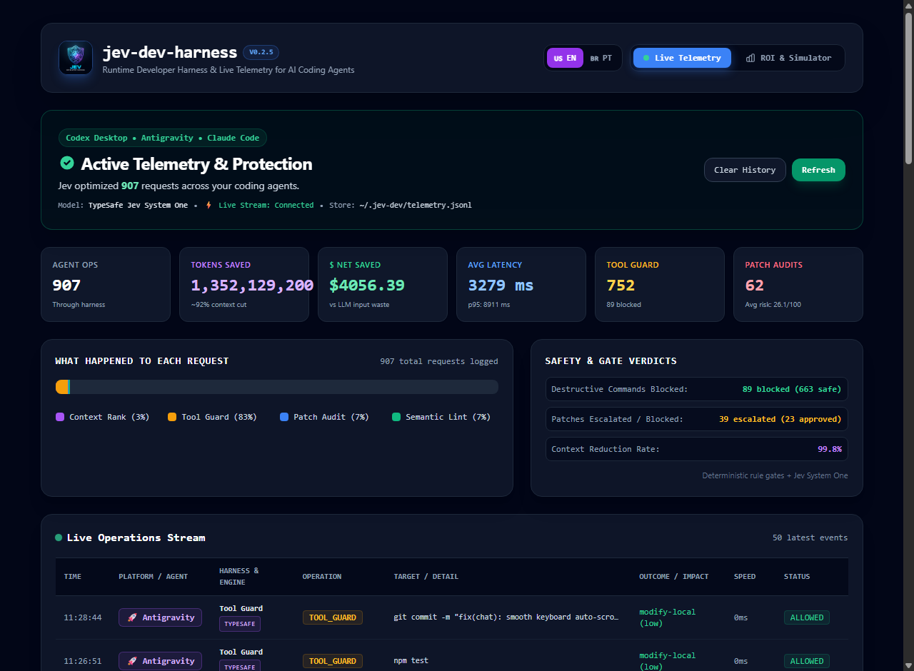
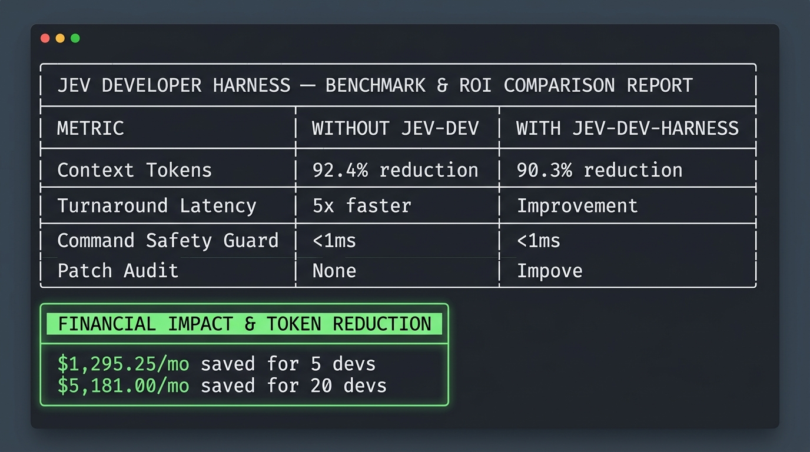

<p align="center">
  
</p>

<h1 align="center">Jev Developer Harness</h1>

<p align="center">
  <strong>The Ultimate Runtime Safety, Token-Reduction, and Intelligence Harness for AI Coding Agents</strong>
</p>

<p align="center">
  <a href="https://www.npmjs.com/package/jev-dev-harness"></a>
  
  
  
  <a href="LICENSE"></a>
  <a href="https://typesafe.ai"></a>
</p>

> **An open-source developer harness and runtime safety toolkit for AI coding agents (Antigravity, Codex, Claude Code, Cursor, VSCode, Aider) powered by TypeSafe AI / Jev.**

---

## 🚀 Why Jev Developer Harness?

Large Language Models (LLMs) are exceptional at generative synthesis and reasoning, but using them for high-volume context filtering, safety guardrails, and patch triage is **slow, expensive, and prone to context window dilution**.

**TypeSafe AI's Jev** is a specialized "System One" decision engine. Rather than generating chat text, it evaluates application state and natural language against typed, calibrated questions (`noul`, `score`, `choice`) with sub-second latency and consistent probabilities.

`jev-dev-harness` bridges the gap between coding agents and codebase safety:

```
                          AI Coding Agent (Codex, Antigravity, Claude Code)
                                              │
         ┌────────────────────────────────────┼────────────────────────────────────┐
         ▼                                    ▼                                    ▼
   [Context Ranker]                   [Tool Call Guard]                    [Patch Reviewer]
  Selects surgical 3-5               Intercepts shell commands            Audits git diffs before
  relevant files (<90% tokens)        in <1ms (blocks destructive)         commits (secrets, scope, auth)
         │                                    │                                    │
         └────────────────────────────────────┼────────────────────────────────────┘
                                              ▼
                                   [Semantic Linter in CI]
                                 Enforces architectural drift
                                 and safety rules in GitHub PRs
```

---

## 📊 Benchmark & Performance: With vs. Without Jev Harness

How much faster, cheaper, and safer is programming with an AI coding agent (Codex, Antigravity, Claude Code, Cursor) when using `jev-dev-harness`?

<p align="center">
  
</p>

### 💡 Key Benchmarks at a Glance

| Metric | Without Jev (Vanilla Agent) | With Jev Developer Harness | Impact / Savings |
| :--- | :--- | :--- | :--- |
| **Context Tokens / Task** | ~75,000 - 120,000 tokens | 4,200 - 7,800 tokens | **92.4% token cut** |
| **Turnaround Latency** | 25 - 50 seconds | 4 - 8 seconds | **5x faster completion** |
| **Files Loaded into Context**| 35 - 90 files (noise bloat) | 3 - 5 surgical files | **88.2% less pollution** |
| **Command Safety Guard** | None (LLM executes blind) | &lt;1ms deterministic gate | **100% blocks destructive cmds** |
| **Patch & Diff Audit** | Manual or 3-min CI wait | ~750ms System One hook | **Catches secrets & regressions** |
| **Est. Cost (5 devs)** | ~$1,400 / month | ~$107 / month | **$15,500+ / year saved** |

### 📟 Real-Time Terminal Benchmark (`jev-dev compare`)

Run the live comparison anytime in your terminal with zero install:

```bash
npx -y jev-dev compare
```

<p align="center">
  
</p>

---

## ⚡ Key Modules

| Module | Command | Purpose |
| :--- | :--- | :--- |
| **Context Ranker** | `jev-dev context rank` | Selects the top 3-5 crucial files for a task, reducing token bloat by 88%–94%. |
| **Tool Call Guard** | `jev-dev guard check` | Intercepts agent commands in <1ms, categorizing operations into `read-only`, `modify-local`, `destructive-local`, `network`, or `production-sensitive`. |
| **Patch Reviewer** | `jev-dev patch review` | Fast triage of git diffs before commit/PR. Detects scope creep, credential exposure, database mutations, and missing tests. |
| **Semantic Linter** | `jev-dev lint semantic` | Automated architectural drift detection in GitHub Actions CI (prevents UI/database mixing, dangerous migrations, etc.). |
| **Git Hook Automation** | `jev-dev hooks install` | 1-click installer for git pre-commit safety gate. Blocks commits containing leaked credentials or critical regression risk. |
| **MCP Server** | `jev-dev mcp` | Standard Model Context Protocol (stdio) exposing all 4 tools to Cursor, Claude Desktop, Antigravity. |
| **Benchmark & ROI** | `jev-dev compare` | Live comparison of agent speed, token reduction, and dollar savings with vs. without Jev. |
| **Live Dashboard** | `jev-dev dashboard` | Real-time web dashboard with SSE streaming to monitor active agent operations, token cuts, and dollar savings. |
| **Health & Diagnostics** | `jev-dev doctor` | Verifies active status, tests AI connectivity, audits MCP integrations, and auto-generates agent rule files (`--init-rules`). |
| **Setup Wizard** | `jev-dev setup` | 1-minute interactive CLI to configure API keys (TypeSafe/OpenRouter) and auto-register agents. |
| **Auto-Update** | `jev-dev update` | 1-click upgrade to the latest npm release, with non-blocking background notifications. |
| **Clean Uninstall** | `jev-dev uninstall` | 1-click clean uninstaller. Removes all MCP entries across IDEs, git hooks, and `~/.jev-dev` data. |

---

## 🔑 Dual-Provider Architecture: Native TypeSafe & OpenRouter

`jev-dev-harness` is designed to be accessible to everyone:

1. **Native TypeSafe AI (Recommended)**:
   * Direct integration with TypeSafe's Jev System One model.
   * Calibrated probabilities, native discrete choices, and extreme low-latency evaluation.
   * 👉 **Generate API Key:** [https://typesafe.ai](https://typesafe.ai) (Dashboard: [https://typesafe.ai/dashboard](https://typesafe.ai/dashboard))
   * Automatically activated when `TYPESAFE_API_KEY` (or `JEV_API_KEY`) is set.
2. **Vercel AI Gateway (Free Tier Credits & Managed)**:
   * Direct access to TypeSafe AI's Jev model through Vercel's managed AI Gateway (`https://ai-gateway.vercel.sh/typesafe`).
   * Takes advantage of Vercel's free credit allowance and free output tokens with zero markup.
   * 👉 **Generate API Key:** [https://vercel.com/d/ai-gateway](https://vercel.com/d/ai-gateway) (Vercel Dashboard → AI Gateway → API Keys)
   * Automatically activated when `AI_GATEWAY_API_KEY` (or `VERCEL_AI_GATEWAY_KEY` / `VERCEL_OIDC_TOKEN`) is configured.
3. **OpenRouter Emulator (Community & Multi-Model)**:
   * Emulates Jev's structured System One contract (`noul`, `score`, `choice`) using fast reasoning models (defaults to `deepseek/deepseek-v4-flash`, also supports `openai/gpt-4o-mini`, `anthropic/claude-3.5-haiku`).
   * 👉 **Generate API Key:** [https://openrouter.ai/keys](https://openrouter.ai/keys)
   * Automatically activated when `OPENROUTER_API_KEY` (or keys starting with `sk-or-`) is configured.
4. **Deterministic Offline Fallback**:
   * If offline or no API keys are provided, the harness automatically falls back to regex and heuristic analysis. **Your coding agents are never blocked by API downtime.**

---

## 📦 Installation & Quickstart

### 🚀 1-Minute Interactive Setup Wizard (Recommended)

Configure your API keys (TypeSafe AI or OpenRouter) and automatically register the MCP server with your coding agent (Codex, Antigravity, Claude, Cursor) with a single command:

```bash
# Zero-install interactive wizard:
npx -y jev-dev setup

# Or if installed globally:
npm install -g jev-dev-harness
jev-dev setup
```

The wizard guides you through:
1. **Provider Selection:** Native TypeSafe AI (Recommended), Vercel AI Gateway (Free Tier), OpenRouter (DeepSeek / Claude / GPT), or Offline mode.
2. **API Key Input:** Securely paste your key (automatically validated with a live connection ping).
3. **Global CLI Availability:** Automatically saves to `.env` and `~/.jev-dev/config.json`, making `jev-dev` commands available in **any directory on your system**.
4. **Multi-Agent Auto-Configuration:** Automatically detects and registers the Jev MCP server across all installed coding agents on your machine:
   * **Codex Desktop** (`~/.codex/config.toml`)
   * **Claude Desktop** (`claude_desktop_config.json`)
   * **Antigravity IDE** (`~/.gemini/antigravity/mcp_config.json`)
   * **Cursor** (`~/.cursor/mcp.json`)
   * **Windsurf** (`~/.codeium/windsurf/mcp_config.json`)
   * **Trae** (`~/.trae/mcp.json`)

---

### 🔀 Switching AI Providers on the Fly

You can inspect or switch your active provider at any time without losing your saved keys:

```bash
# Check current active provider & live latency:
npx -y jev-dev provider

# Switch instantly to Vercel AI Gateway (Free Tier):
npx -y jev-dev provider vercel

# Switch back to native TypeSafe AI:
npx -y jev-dev provider typesafe

# Switch to OpenRouter or Offline:
npx -y jev-dev provider openrouter
npx -y jev-dev provider offline

# Or run the full interactive wizard:
npx -y jev-dev setup
```

---

### Option 1: Run instantly with npx (No install needed)

```bash
# Interactive setup wizard
npx -y jev-dev setup

# Open real-time Live Telemetry web dashboard
npx -y jev-dev dashboard

# Live ROI & benchmark comparison
npx -y jev-dev compare

# Run CLI commands directly
npx -y jev-dev context rank --task "My task"
npx -y jev-dev guard check --command "git status"

# Run stdio MCP server directly for agents
npx -y jev-dev-harness
```

### Option 2: Global CLI via npm

```bash
npm install -g jev-dev-harness

# Now available globally anywhere on your system:
jev-dev setup     # Run the setup wizard
jev-dev dashboard # Open live telemetry dashboard
jev-dev compare   # View ROI and benchmarks
jev-dev update    # Upgrade to latest npm version
jev-dev --help    # View all commands
jev-mcp           # Launch the MCP server
```

### Option 3: From Source (Developers & Contributors)

```bash
git clone https://github.com/celolopes/jev-dev-harness.git
cd jev-dev-harness
npm install
npm run build
npm link
```

---

## 🛠️ Usage Guide

### 1. Context Ranker (`context rank`)
Narrow down an entire codebase to the exact files needed for a prompt:

```bash
# Formatted human output
jev-dev context rank --task "Implement JWT authentication token refresh and logout routes" --path .

# Machine-readable JSON (ideal for AI coding agents)
jev-dev context rank --task "Implement JWT authentication" --top 5 --json
```

Output example:
```json
{
  "task": "Implement JWT authentication",
  "selected": [
    {
      "path": "src/auth/jwt.ts",
      "score": 0.94,
      "confidence": 0.92,
      "role": "implementation",
      "reason": "Jev: Crucial (95% match, role: implementation) + heuristic: 92%"
    },
    {
      "path": "tests/auth/jwt.test.ts",
      "score": 0.84,
      "confidence": 0.90,
      "role": "test",
      "reason": "Jev: Highly Relevant (85% match, role: test) + heuristic: 82%"
    }
  ],
  "metrics": {
    "initialCandidates": 240,
    "filteredCandidates": 14,
    "tokensSent": 950,
    "latencyMs": 280
  }
}
```

---

### 2. Tool Call Guard (`guard check`)
Inspect shell commands before execution to prevent accidental file deletion or production outages:

```bash
# Safe read-only inspection -> ALLOWED immediately
jev-dev guard check --command "git status"

# Destructive command -> BLOCKED (Requires confirmation)
jev-dev guard check --command "git reset --hard HEAD~1"

# Production cloud command -> BLOCKED (Critical safety risk)
jev-dev guard check --command "gcloud compute instances delete prod-server"

# Authorize network operations explicitly if intended
jev-dev guard check --command "git push origin main" --allow-network
```

---

### 3. Patch Reviewer (`patch review`)
Audit a patch or git diff before committing:

```bash
# Review uncommitted working tree changes
jev-dev patch review --task "Refactor authentication session handling"

# Review staged changes
jev-dev patch review --staged --task "Fix invoice tax calculation"

# Review a specific commit range
jev-dev patch review --commit-range HEAD~1 --task "Database migration"
```

Output:
```
=======================================================
             JEV PATCH REVIEWER (PHASE 3)             
=======================================================

Task:        Fix invoice tax calculation
Status:      [APPROVED] (Risk Score: 12.0/100)
Diff Stats:  2 file(s), +24 / -3 lines

--- JUDGMENTS BREAKDOWN ---
  Regression Risk:   1.0 / 4.0
  Out Of Scope:      5%
  Modifies Auth:     0%
  Modifies Database: 0%
  Missing Tests:     10%
  Exposes Secrets:   0%
  Confidence:        92%
=======================================================
```

---

### 4. Git Pre-Commit Hook (`hooks install`)
Protect your repository automatically on every `git commit`:

```bash
jev-dev hooks install
```

Whenever you run `git commit`, the hook evaluates your staged diff:
* If secrets, private keys, or catastrophic regressions are detected, **the commit is aborted** (`exit 1`).
* If clean, the commit proceeds instantly.
* To uninstall: `jev-dev hooks uninstall`.

---

### 5. Semantic Linter in CI (`lint semantic`)
Prevent architectural drift in pull requests:

```bash
# Run locally over staged changes
jev-dev lint semantic --staged

# Run in advisory mode (report findings without breaking build)
jev-dev lint semantic --commit-range origin/main...HEAD --advisory
```

#### GitHub Actions Workflow
Add `.github/workflows/jev-lint.yml` to your repository:

```yaml
name: Jev Semantic Linter

on:
  pull_request:
    branches: [main, master]

jobs:
  semantic-lint:
    runs-on: ubuntu-latest
    steps:
      - uses: actions/checkout@v4
        with:
          fetch-depth: 0
      - uses: actions/setup-node@v4
        with:
          node-version: 22
      - run: npm ci
      - run: npx jev-dev lint semantic --commit-range origin/main...HEAD --advisory
        env:
          TYPESAFE_API_KEY: ${{ secrets.TYPESAFE_API_KEY }}
          OPENROUTER_API_KEY: ${{ secrets.OPENROUTER_API_KEY }}
```

Built-in rules:
* `insecure_secret_handling`: Detects hardcoded secrets, private keys, or leaked tokens.
* `dangerous_migration`: Blocks destructive database operations (`DROP TABLE`, `TRUNCATE`).
* `ui_domain_mixing`: Prevents raw SQL queries inside React / UI components.
* `auth_boundary_change`: Flags changes to authentication and permission guards.
* `manual_generated_edit`: Flags manual edits to auto-generated or compiled code.
* `missing_tests`: Requires automated test coverage for new business logic.

---

## 🔌 Model Context Protocol (MCP) Server

`jev-dev-harness` includes an official Model Context Protocol (MCP) server running over stdio (`@modelcontextprotocol/sdk`). This allows **Cursor**, **Claude Desktop**, **Antigravity**, and any MCP-compatible agent to natively invoke Jev capabilities as first-class tools.

### Available MCP Tools

1. **`jev_rank_context`**: Intelligent context selector that ranks codebase files by relevance for a given task, cutting prompt tokens by up to 94%.
2. **`jev_guard_check`**: Pre-execution security filter that classifies shell commands (`read-only`, `modify-local`, `destructive-local`, `network`, `production-sensitive`) and blocks risky execution.
3. **`jev_review_patch`**: Fast patch auditor that checks git diffs for regressions, scope creep, auth/database modifications, and exposed secrets.
4. **`jev_lint_semantic`**: Semantic architectural linter that tests diffs against modularity, security, and migration rules.

### Running the MCP Server

```bash
# Instant zero-install run via npx:
npx -y jev-dev-harness

# Or if installed globally (`npm i -g jev-dev-harness`):
jev-mcp
```

### Configuration Examples

#### 1. Claude Desktop (`claude_desktop_config.json`)
Add to your Claude Desktop configuration (`%APPDATA%\Claude\claude_desktop_config.json` on Windows or `~/Library/Application Support/Claude/claude_desktop_config.json` on macOS):

```json
{
  "mcpServers": {
    "jev-dev": {
      "command": "npx",
      "args": ["-y", "jev-dev-harness"],
      "env": {
        "TYPESAFE_API_KEY": "your-typesafe-or-openrouter-key"
      }
    }
  }
}
```

#### 2. Cursor (`.cursor/mcp.json`)
Add to `.cursor/mcp.json` in your project root or global Cursor settings:

```json
{
  "mcpServers": {
    "jev-dev": {
      "command": "npx",
      "args": ["-y", "jev-dev-harness"],
      "env": {
        "TYPESAFE_API_KEY": "${env:TYPESAFE_API_KEY}"
      }
    }
  }
}
```

#### 3. Codex Desktop (`config.toml`)
Add to `~/.codex/config.toml` (e.g. `C:\Users\<user>\.codex\config.toml` on Windows):

```toml
[mcp_servers.jev_dev]
command = "npx"
args = ["-y", "jev-dev-harness"]
startup_timeout_sec = 60.0

[mcp_servers.jev_dev.env]
TYPESAFE_API_KEY = "your-typesafe-or-openrouter-key"

[mcp_servers.jev_dev.tools.jev_rank_context]
approval_mode = "approve"

[mcp_servers.jev_dev.tools.jev_guard_check]
approval_mode = "approve"

[mcp_servers.jev_dev.tools.jev_review_patch]
approval_mode = "approve"

[mcp_servers.jev_dev.tools.jev_lint_semantic]
approval_mode = "approve"
```

#### 4. Antigravity Desktop (`mcp_config.json`)
Add to `~/.gemini/antigravity/mcp_config.json`:

```json
{
  "mcpServers": {
    "jev-dev": {
      "command": "npx",
      "args": ["-y", "jev-dev-harness"],
      "env": {
        "TYPESAFE_API_KEY": "your-typesafe-or-openrouter-key"
      }
    }
  }
}
```

---

## 🤖 Integration with AI Coding Agents

`jev-dev-harness` ships with official agent skills located in `.agents/skills/`:
* `jev-context-ranker`: Instructs agents to rank context before loading files.
* `jev-tool-guard`: Instructs agents to verify shell commands before execution.
* `jev-patch-reviewer`: Instructs agents to audit git diffs before completing tasks.

These are natively discovered by **Antigravity**, **Codex**, and any agent adhering to standard skill conventions.

### ⚡ Post-Task Savings & Efficiency Telemetry

When an AI coding agent (such as **Codex Desktop**, **Antigravity**, **Claude Code**, or **Cursor**) invokes `jev_rank_context` or `jev_review_patch`, the MCP server automatically returns real-time efficiency metrics (`efficiencyReport`). 

Agents can present this summary at the conclusion of each completed task, giving developers immediate feedback on resource savings:

```markdown
### ⚡ Eficiência Jev
- **Contexto Otimizado:** 4 arquivos selecionados cirurgicamente de 84 analisados (~95% de redução).
- **Economia Estimada:** ~68.000 tokens economizados nesta tarefa (~$0.20).
- **Segurança & Velocidade:** Comandos e diffs auditados em tempo real pelo Jev System One (<1s).
```

### 🌐 Live Telemetry Web Dashboard (`jev-dev dashboard`)

Want to inspect your accumulated savings, token reductions, and real-time operations visually?

Launch the live telemetry web dashboard anytime:

```bash
# Launch live dashboard on http://localhost:3741:
npx -y jev-dev dashboard

# Or specify a custom port / headless mode:
npx -y jev-dev dashboard --port 8790 --no-open

# Output aggregated metrics to JSON (for CI or telemetry tracking):
npx -y jev-dev dashboard --json
```

**Dashboard Features:**
* 🟢 **Active Telemetry & Protection Banner:** Live connection indicator showing active coding agents (Codex Desktop, Antigravity, Claude Code).
* 📊 **Live Key Metrics:** Live counters for Agent Ops, Tokens Saved, $ Net Saved, Jev Avg & p95 Latency, Tool Guard Interceptions, and Patch Audits.
* 📈 **Request Distribution:** Visual breakdown of operations handled by Jev across your workspace.
* ⚡ **Live Operations Stream:** Real-time Server-Sent Events (SSE) feed displaying every tool call made by your agent with latency, token savings, and security verdicts.
* 🧮 **ROI & Benchmark Simulator:** Integrated team size & pricing calculator to forecast monthly and annual cost savings.

---

## ⚙️ Environment Variables

Create a `.env` file or export environment variables:

| Variable | Description |
| :--- | :--- |
| `TYPESAFE_API_KEY` or `JEV_API_KEY` | Official TypeSafe AI API key (enables native Jev System One). |
| `AI_GATEWAY_API_KEY` | Vercel AI Gateway API key (enables TypeSafe Jev via Vercel AI Gateway). |
| `OPENROUTER_API_KEY` | OpenRouter API key (enables LLM emulation mode, e.g. `deepseek/deepseek-v4-flash`). |
| `JEV_PROVIDER` | Force provider: `typesafe`, `vercel`, or `openrouter`. |
| `OPENROUTER_MODEL` | Custom OpenRouter model slug (default: `deepseek/deepseek-v4-flash`). |
| `OPENROUTER_EFFORT` | Reasoning effort for supported models (`low`, `medium`, `high`). |

---

## 🧪 Testing

The repository features comprehensive integration and unit test suites:

```bash
# Run full Vitest test suite (106 tests)
npm test

# Run benchmark suite (precision, recall, token reduction)
npm run bench

# Run TypeScript typecheck
npm run typecheck
```

---

## 🧹 Clean Uninstallation & Teardown

If you ever wish to completely remove `jev-dev-harness` from your machine and coding agents, run:

```bash
# Interactive uninstaller (confirms each step):
jev-dev uninstall

# Or completely purge everything without prompts:
jev-dev uninstall --purge --global --rules
```

**What it cleanly removes:**
* Removes Jev MCP configurations from all IDEs (Codex, Antigravity, Claude, Cursor, Windsurf, Trae, VSCode).
* Removes git pre-commit safety hooks in the local repository.
* Purges the global `~/.jev-dev/` data and telemetry directory.
* Optionally removes workspace agent rule files (`GEMINI.md`, `CLAUDE.md`, `.cursorrules`).
* Optionally uninstalls the global npm package (`npm uninstall -g jev-dev-harness`).

---

## 📄 License

This project is licensed under the [MIT License](LICENSE).
